# Diagram Architektury UI - Autentykacja Initiative Forge

Ten diagram przedstawia architekturę komponentów UI dla modułu autentykacji w aplikacji Initiative Forge, pokazując strukturę stron Astro, komponentów React, przepływ danych oraz zależności między elementami systemu.

## Opis diagramu

Diagram pokazuje:
- **Strukturę stron Astro** - auth pages i główna aplikacja
- **Layouts** - dedykowane layouty dla różnych sekcji
- **Komponenty React** - formularze autentykacji i UI współdzielone
- **Hooks i Store** - zarządzanie stanem
- **Middleware i Backend** - ochrona tras i API
- **Przepływ danych** - komunikacja między warstwami
- **Komponenty wymagające aktualizacji** - oznaczone jako "MODYFIKACJA"

## Legenda

- **Prostokąty** - Strony Astro i komponenty React
- **Zaokrąglone prostokąty** - Layouts i middleware
- **Romby** - Punkty decyzyjne (middleware)
- **Grube strzałki** `==>` - Główny przepływ renderowania
- **Cienkie strzałki** `-->` - Zależności i użycie
- **Kropkowane strzałki** `-.->` - Komunikacja API
- **Subgrafy** - Grupowanie funkcjonalne

```mermaid
flowchart TD
    subgraph "Backend Layer"
        MW{Middleware}
        SBC[Supabase Client Server]
        SBB[Supabase Browser Client]

        subgraph "API Endpoints (MODYFIKACJA - userId)"
            API_C["/api/campaigns"]
            API_CH["/api/characters"]
            API_CO["/api/combats"]
        end

        subgraph "Public API (bez zmian)"
            API_M["/api/monsters"]
            API_S["/api/spells"]
        end
    end

    subgraph "State Management"
        UA[useAuth Hook]
        CS[campaignStore]
        AS[authStore opcjonalny]
    end

    subgraph "Auth Pages (NOWE)"
        direction TB

        AL(AuthLayout)

        LP["login.astro"]
        RP["register.astro"]
        PP["reset-password.astro"]
        CB["callback.astro"]

        LP ==> LF[LoginForm]
        RP ==> RF[RegisterForm]
        PP ==> PRF[PasswordResetForm]

        LP -.-> AL
        RP -.-> AL
        PP -.-> AL
        CB -.-> AL
    end

    subgraph "Main App Pages (CHRONIONE)"
        direction TB

        ML(MainLayout MODYFIKACJA)

        CAP["campaigns.astro"]
        CDP["campaigns/[id].astro"]
        MOP["monsters.astro"]
        SPP["spells.astro"]
        COP["combat/[id].astro"]

        CAP -.-> ML
        CDP -.-> ML
        MOP -.-> ML
        SPP -.-> ML
        COP -.-> ML
    end

    subgraph "Shared Components"
        direction LR

        SC["SidebarContent MODYFIKACJA"]
        UM["UserMenu NOWY"]
        AH["AppHeader"]
        GN["GlobalNav"]
        AG["AuthGuard NOWY"]

        SC --> UM
        SC --> AH
        SC --> GN
    end

    subgraph "Shadcn UI Components"
        direction LR
        BTN[Button]
        INP[Input]
        FRM[Form]
        DRP[DropdownMenu]
        AVT[Avatar]
    end

    %% Middleware Flow
    MW -->|"Sprawdza sesję"| SBC
    MW -->|"Sesja OK"| ML
    MW -->|"Brak sesji + chroniona"| LP

    %% Auth Forms Flow
    LF --> UA
    RF --> UA
    PRF --> UA

    UA --> SBB
    SBB -.->|"signIn/signUp/resetPassword"| SUPA[Supabase Auth]

    %% Callback handling
    CB -->|"Weryfikuje token"| SBC
    CB -.->|"Po weryfikacji"| LP

    %% Main Layout Components
    ML ==> SC

    %% UserMenu dependencies
    UM --> UA
    UM --> BTN
    UM --> DRP
    UM --> AVT

    %% Auth Forms dependencies
    LF --> BTN
    LF --> INP
    LF --> FRM

    RF --> BTN
    RF --> INP
    RF --> FRM

    PRF --> BTN
    PRF --> INP
    PRF --> FRM

    %% Pages using state
    CAP --> UA
    CAP --> CS

    CDP --> UA

    %% API calls from pages
    CAP -.->|"GET/POST userId"| API_C
    CDP -.->|"PATCH/DELETE userId"| API_CH
    COP -.->|"Combat data userId"| API_CO

    MOP -.->|"Public read"| API_M
    SPP -.->|"Public read"| API_S

    %% API using Supabase
    API_C --> SBC
    API_CH --> SBC
    API_CO --> SBC
    API_M --> SBC
    API_S --> SBC

    %% AuthGuard usage
    AG --> UA
    AG -.->|"Przekierowanie"| LP

    %% Auth Store (optional)
    UA -.->|"Opcjonalnie"| AS

    %% Styling
    classDef newComponent fill:#90EE90,stroke:#228B22,stroke-width:2px
    classDef modifiedComponent fill:#FFD700,stroke:#FF8C00,stroke-width:2px
    classDef layoutComponent fill:#87CEEB,stroke:#4682B4,stroke-width:2px
    classDef middleware fill:#FFB6C1,stroke:#C71585,stroke-width:2px
    classDef stateComponent fill:#DDA0DD,stroke:#8B008B,stroke-width:2px

    class LP,RP,PP,CB,LF,RF,PRF,UM,AG,AS newComponent
    class SC,ML,MW,API_C,API_CH,API_CO modifiedComponent
    class AL,ML layoutComponent
    class MW middleware
    class UA,CS,AS stateComponent
```

<mermaid_diagram>



</mermaid_diagram>

## Szczegółowy opis komponentów

### 1. Backend Layer

#### Middleware (`middleware/index.ts`) - MODYFIKACJA
- **Funkcja:** Sprawdzanie sesji użytkownika przy każdym żądaniu
- **Odpowiedzialność:**
  - Tworzenie klienta Supabase z obsługą cookies
  - Weryfikacja sesji przez `getUser()`
  - Udostępnienie `context.locals.supabase` i `session`
  - Przekierowanie niezalogowanych z chronionych tras do `/auth/login`
- **Modyfikacja:** Dodanie logiki ochrony tras i przekierowań

#### Klienty Supabase
- **`supabase.client.ts`** - Klient server-side dla API endpoints
- **`supabase.browser.ts`** - Klient dla komponentów React w przeglądarce
- **Funkcja:** Komunikacja z Supabase Auth i Database

#### API Endpoints - MODYFIKACJA
- **`/api/campaigns`**, `/api/characters`, `/api/combats` - Wymagają aktualizacji
- **Zmiana:** Pobieranie `userId` z sesji zamiast hardkodowanego `DEFAULT_USER_ID`
- **Ochrona:** RLS policies w Supabase + weryfikacja userId
- **Publiczne API:** `/api/monsters`, `/api/spells` - bez zmian (dane SRD)

### 2. State Management

#### `useAuth()` Hook - ROZSZERZENIE
- **Obecna funkcjonalność:**
  - `user: UserViewModel | null` - Dane zalogowanego użytkownika
  - `isLoading: boolean` - Stan ładowania
  - `error: Error | null` - Błędy
  - `logout()` - Wylogowanie użytkownika
- **Planowane rozszerzenie:**
  - `login(email, password)` - Logowanie
  - `register(email, password)` - Rejestracja
  - `resetPassword(email)` - Reset hasła
- **Źródło danych:** `supabase.browser.ts` → Supabase Auth

#### `campaignStore.ts` (Zustand)
- **Funkcja:** Zarządzanie aktualnie wybraną kampanią
- **Persist:** localStorage
- **Bez zmian** w kontekście autentykacji

#### `authStore.ts` (Zustand) - OPCJONALNY
- **Funkcja:** Globalne przechowywanie stanu użytkownika
- **Alternatywa:** Można polegać tylko na `useAuth()` hook
- **Korzyści:** Synchronizacja stanu między komponentami

### 3. Auth Pages (NOWE)

#### Layouts

**`AuthLayout.astro`** - NOWY
- **Funkcja:** Dedykowany layout dla stron autentykacji
- **Cechy:**
  - Bez sidebara
  - Wycentrowana zawartość
  - Logo aplikacji
  - Dark theme zgodny z aplikacją
- **Używany przez:** login, register, reset-password, callback

**`MainLayout.astro`** - MODYFIKACJA
- **Funkcja:** Layout dla zalogowanych użytkowników
- **Modyfikacja:**
  - Integracja z middleware (sprawdzanie sesji)
  - Przekazywanie danych użytkownika do sidebara
- **Zawiera:** `SidebarContent.tsx` z `UserMenu.tsx`

#### Strony Astro

**`/auth/login.astro`** - NOWY
- **Funkcja:** Kontener formularza logowania
- **Server-side:**
  - Sprawdzenie sesji (jeśli zalogowany → redirect do `/campaigns`)
  - Obsługa parametru `?redirect` dla przekierowań po zalogowaniu
- **Renderuje:** `LoginForm.tsx` z `client:load`

**`/auth/register.astro`** - NOWY
- **Funkcja:** Kontener formularza rejestracji
- **Server-side:** Sprawdzenie sesji (przekierowanie zalogowanych)
- **Renderuje:** `RegisterForm.tsx`

**`/auth/reset-password.astro`** - NOWY
- **Funkcja:** Kontener formularza resetu hasła
- **Strona publiczna:** Bez sprawdzania sesji
- **Renderuje:** `PasswordResetForm.tsx`

**`/auth/callback.astro`** - NOWY
- **Funkcja:** Obsługa callbacków z emaili
- **Typy callbacków:**
  - Weryfikacja emaila (confirmation)
  - Reset hasła (recovery)
- **Logika:**
  - Weryfikacja tokenu z URL przez Supabase Auth
  - Wyświetlenie statusu operacji
  - Przekierowanie do odpowiedniej strony

#### Komponenty React

**`LoginForm.tsx`** - NOWY
- **Funkcja:** Formularz logowania
- **Pola:** Email, Hasło
- **Walidacja:** Format email, wymagane pola
- **Akcje:**
  - Wywołanie `useAuth().login(email, password)`
  - Obsługa błędów (email niezweryfikowany, nieprawidłowe dane)
  - Przekierowanie po sukcesie przez `navigate()`
- **Link:** "Zapomniałem hasła" → `/auth/reset-password`
- **UI:** Wykorzystuje Shadcn Form, Input, Button

**`RegisterForm.tsx`** - NOWY
- **Funkcja:** Formularz rejestracji
- **Pola:** Email, Hasło, Potwierdzenie hasła
- **Walidacja:**
  - Format email
  - Zgodność haseł
  - Siła hasła (delegowana do Supabase)
- **Akcje:**
  - Wywołanie `useAuth().register(email, password)`
  - Obsługa błędów (email zajęty, słabe hasło)
  - Komunikat o wysłaniu emaila weryfikacyjnego
- **UI:** Wykorzystuje Shadcn Form, Input, Button

**`PasswordResetForm.tsx`** - NOWY
- **Funkcja:** Formularz żądania resetu hasła
- **Pola:** Email
- **Akcje:**
  - Wywołanie `useAuth().resetPassword(email)`
  - Komunikat o wysłaniu emaila z linkiem
- **UI:** Wykorzystuje Shadcn Form, Input, Button

**`AuthGuard.tsx`** - NOWY (opcjonalny)
- **Funkcja:** Wrapper sprawdzający sesję użytkownika
- **Użycie:** Ochrona komponentów React (alternatywa dla middleware)
- **Logika:**
  - Sprawdzenie `useAuth().user`
  - Jeśli brak → przekierowanie do `/auth/login`
  - Jeśli loading → wyświetlenie loadera
- **Uwaga:** W Astro SSR preferowane jest middleware do ochrony tras

### 4. Main App Pages (CHRONIONE)

#### Strony aplikacji głównej
- **`/campaigns.astro`** - Lista kampanii użytkownika
- **`/campaigns/[id].astro`** - Szczegóły kampanii
- **`/monsters.astro`** - Biblioteka potworów (tylko dla zalogowanych)
- **`/spells.astro`** - Biblioteka czarów (tylko dla zalogowanych)
- **`/combat/[id].astro`** - Moduł walki

**Wspólne cechy:**
- Używają `MainLayout.astro`
- Chronione przez middleware (wymaga sesji)
- Dostęp do `context.locals.supabase` i `session`
- Wywołują API z userId z sesji

### 5. Shared Components

#### `SidebarContent.tsx` - MODYFIKACJA
- **Obecna funkcja:** Główny sidebar z nawigacją
- **Modyfikacja:**
  - Dodanie sekcji użytkownika w górnej części
  - Integracja `UserMenu.tsx`
  - Użycie `useAuth()` do pobrania danych użytkownika
  - Stan loading podczas pobierania danych
- **Zawiera:** `AppHeader`, `GlobalNav`, `UserMenu`

#### `UserMenu.tsx` - NOWY
- **Funkcja:** Menu użytkownika
- **Wyświetla:**
  - Email użytkownika
  - Avatar (inicjały jako fallback)
  - Przycisk wylogowania
- **Akcje:**
  - Wywołanie `useAuth().logout()`
  - Przekierowanie do `/auth/login`
- **UI:** Wykorzystuje Shadcn DropdownMenu, Avatar, Button
- **Dane:** `useAuth().user`

#### `AppHeader.tsx`, `GlobalNav.tsx`
- **Funkcja:** Nagłówek i nawigacja sidebara
- **Bez zmian** w kontekście autentykacji

### 6. Shadcn UI Components

Wykorzystywane komponenty z biblioteki Shadcn/ui:
- **Button** - Przyciski w formularzach i menu
- **Input** - Pola formularzy
- **Form** - Zarządzanie formularzami (React Hook Form)
- **DropdownMenu** - Menu użytkownika
- **Avatar** - Avatar użytkownika
- **Card, Label, Alert** - Dodatkowe komponenty UI

## Przepływ danych

### Scenariusz 1: Logowanie

1. User → `/auth/login` → `login.astro` sprawdza sesję server-side
2. Jeśli niezalogowany → renderuje `LoginForm.tsx`
3. User wypełnia formularz → `LoginForm` wywołuje `useAuth().login()`
4. `useAuth()` → `supabase.browser.ts` → Supabase Auth API
5. Supabase Auth → weryfikuje dane → ustawia secure cookies
6. `LoginForm` → `navigate('/campaigns')`
7. Middleware przechwytuje żądanie → sprawdza sesję → OK
8. `campaigns.astro` → renderuje z `MainLayout` → `SidebarContent` → `UserMenu`
9. `UserMenu` → `useAuth().user` → wyświetla dane użytkownika

### Scenariusz 2: Dostęp do chronionej strony (niezalogowany)

1. User → `/campaigns` (bezpośredni link)
2. Middleware → sprawdza sesję → BRAK
3. Middleware → redirect `/auth/login?redirect=/campaigns`
4. User loguje się
5. Po sukcesie → redirect do `/campaigns` (z parametru)

### Scenariusz 3: Wywołanie API z autentykacją

1. `campaigns.astro` (server-side) → `context.locals.supabase.auth.getUser()`
2. Otrzymuje `userId` z sesji
3. API call → `/api/campaigns` z userId
4. API endpoint → weryfikuje sesję → używa userId
5. Supabase Database → RLS policy sprawdza `auth.uid() = userId`
6. Zwraca dane tylko dla tego użytkownika

### Scenariusz 4: Wylogowanie

1. User klika "Wyloguj" w `UserMenu`
2. `UserMenu` → `useAuth().logout()`
3. `useAuth()` → `supabase.browser.ts.signOut()`
4. Supabase → usuwa sesję i cookies
5. `useAuth()` → `localStorage.clear()`
6. `useAuth()` → `navigate('/auth/login')`
7. User przekierowany do strony logowania

## Komponenty według statusu

### NOWE komponenty (do implementacji)

- ✅ `AuthLayout.astro`
- ✅ `/auth/login.astro`
- ✅ `/auth/register.astro`
- ✅ `/auth/reset-password.astro`
- ✅ `/auth/callback.astro`
- ✅ `LoginForm.tsx`
- ✅ `RegisterForm.tsx`
- ✅ `PasswordResetForm.tsx`
- ✅ `UserMenu.tsx`
- ✅ `AuthGuard.tsx` (opcjonalny)
- ✅ `authStore.ts` (opcjonalny)

### MODYFIKACJE istniejących

- 🔧 `MainLayout.astro` - integracja z middleware
- 🔧 `SidebarContent.tsx` - dodanie sekcji użytkownika i `UserMenu`
- 🔧 `middleware/index.ts` - ochrona tras, przekierowania
- 🔧 `useAuth()` hook - rozszerzenie o login, register, resetPassword
- 🔧 `/api/campaigns.ts` - userId z sesji zamiast DEFAULT_USER_ID
- 🔧 `/api/characters.ts` - userId z sesji
- 🔧 `/api/combats.ts` - userId z sesji

### BEZ ZMIAN

- ✓ Strony aplikacji głównej (kampanie, walka, biblioteki) - tylko chronione przez middleware
- ✓ Komponenty walki, kampanii, postaci
- ✓ `campaignStore.ts`
- ✓ API monsters i spells (publiczne dane SRD)
- ✓ Komponenty Shadcn/ui
- ✓ Klienty Supabase (już skonfigurowane)

## Zależności między modułami

### Autentykacja → Reszta aplikacji

1. **Middleware** → Chroni wszystkie strony aplikacji głównej
2. **useAuth()** → Używany przez `UserMenu` w sidebarze (widoczny wszędzie)
3. **Session/userId** → Przekazywany do wszystkich API endpoints
4. **AuthGuard** → Opcjonalnie może chronić komponenty React

### Aplikacja główna → Autentykacja

1. **Wszystkie strony** → Zależą od middleware sprawdzającego sesję
2. **API calls** → Wymagają userId z sesji
3. **UserMenu w sidebarze** → Wyświetla dane użytkownika i opcję logout
4. **Przekierowania** → Brak sesji → `/auth/login`

## Architektura warstwowa

```
┌─────────────────────────────────────────────┐
│          PRESENTATION LAYER                 │
│  (Astro Pages + React Components)           │
│  - Auth Pages (login, register, etc.)       │
│  - App Pages (campaigns, combat, etc.)      │
│  - Shared Components (Sidebar, UserMenu)    │
└─────────────────────────────────────────────┘
                    ↓
┌─────────────────────────────────────────────┐
│          STATE MANAGEMENT LAYER             │
│  - useAuth() Hook                           │
│  - campaignStore (Zustand)                  │
│  - authStore (Zustand, opcjonalny)          │
└─────────────────────────────────────────────┘
                    ↓
┌─────────────────────────────────────────────┐
│          MIDDLEWARE LAYER                   │
│  - Auth Middleware (ochrona tras)           │
│  - Supabase SSR Integration                 │
└─────────────────────────────────────────────┘
                    ↓
┌─────────────────────────────────────────────┐
│          API LAYER                          │
│  - API Endpoints (campaigns, characters)    │
│  - Supabase Clients (server & browser)      │
└─────────────────────────────────────────────┘
                    ↓
┌─────────────────────────────────────────────┐
│          BACKEND SERVICES                   │
│  - Supabase Auth                            │
│  - Supabase Database (PostgreSQL + RLS)     │
└─────────────────────────────────────────────┘
```

## Uwagi implementacyjne

1. **Kolejność implementacji:**
   - Backend najpierw (middleware, API userId)
   - Layouts (AuthLayout, MainLayout)
   - Auth Pages + Forms
   - UserMenu + integracja w SidebarContent
   - Testy przepływu end-to-end

2. **Astro View Transitions:**
   - Wszystkie przekierowania przez `navigate()` z `astro:transitions/client`
   - NIE używać `window.location.href` (z wyjątkiem logout)

3. **Bezpieczeństwo:**
   - Middleware jako pierwsza linia obrony
   - RLS policies w Supabase jako druga warstwa
   - Walidacja userId w każdym API endpoint

4. **UX:**
   - Loading states w formularzach
   - Czytelne komunikaty błędów
   - Redirect do docelowej strony po zalogowaniu (`?redirect` parameter)
